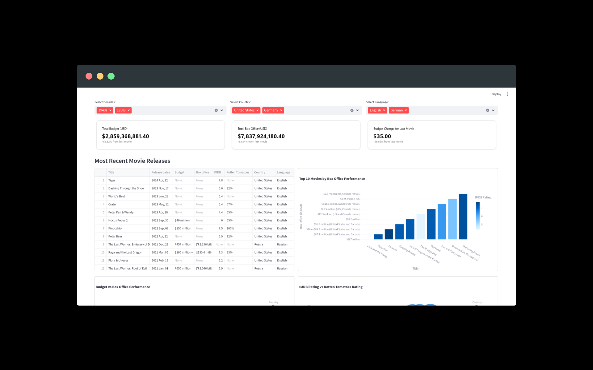

# Disney Movie Analysis Dashboard

This project analyzes Disney movies and presents key insights on their performance over time, including budget, box office collections, and other relevant metrics. The goal is to provide a visual dashboard that tracks the performance of Disney movies over different periods.


## Features

- **Scraping Disney Movie Data**: The project uses web scraping to gather a list of Disney movies from Wikipedia and other sources.
- **Data Cleaning**: The raw data is cleaned and structured for easier analysis.
- **Performance Analytics**: Key metrics like budget, box office collections, and release year are analyzed.
- **Visualization Dashboard**: A dashboard (built using tools like **Streamlit**) displays the analysis and visualizations of Disney movie performance.

## Technologies Used

- **Python**: Core programming language used for data scraping, cleaning, and analysis.
- **BeautifulSoup**: For web scraping and extracting Disney movie data from Wikipedia.
- **Pandas**: For data manipulation and cleaning.
- **Plotly**: For creating visualizations to analyze the data.
- **Streamlit**: For building the interactive dashboard.
  
## Data Sources

- The data is primarily sourced from Wikipedia’s list of Disney movies.
- Used OMDB API to fetch critical ratings.

## Setup

### 1. Clone the repository:
```bash
git clone https://github.com/USERNAME/disney-movie-analysis.git
cd disney-movie-analysis
```
### 2. Install the requirements:
```bash
pip install -r requirements.txt
python main.py
```

